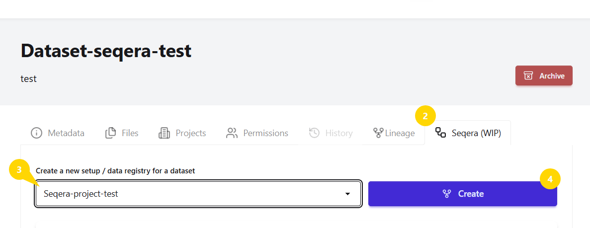

# Create a New Dataset

This guide walks you through the steps to create a new dataset in the Data Catalog.

```{note}
There are fields on the dataset creation page that are automatically generated by the system, such as **Dataset Identifier**, **Dataset Creator** and **Access Rights**. Some of these fields cannot be changed.
```

## Step 1: Navigate to the Dataset List Page 
Both of the following options will take you to the Dataset List page, where you can create a new dataset:

* Click the **`Datasets`** button on the Data Catalog welcome page 

    **or** 

* Use the **`Datasets`** tab located at the top of any page.


## Step 2: Add a New Dataset
On the Dataset List page, click the **`Add a new dataset`** button located right below the ***Search*** bar.


## Step 3: Choose a Parent Project
Select a project from the list to link your dataset. If needed, you can unlink the dataset at any time.


```{tip}
Choosing a Parent Project ***links*** your dataset to the project it belongs to. This ensures your data stays organized, easy to find and correctly associated. 
```


## Step 4: Fill in Dataset Metadata
Complete all the required fields marked with **`*`**:

* Dataset Title (`*`)
* Dataset Description
* Dataset Type (`*`):
    * Raw
    * Processed
    * Results
* Resource Type
* Instrument

```{note}
→ **Resource Type**: The type of experimental or analytical methodology that generates the data (e.g., DNA sequencing, RNA sequencing, Proteomics (DIA)).<br/>

→ **Instrument**: The equipment used to generate the data (e.g., MiSeq (Illumina), NextSeq (Illumina), GridION (Nanopore)).
```

## Final Step: Complete your Dataset
Click `Create dataset` at the ***bottom*** of the page to complete the process.


<br/>

-------------------------------

<br/>

```{raw} html
<div style="text-align: center;">
  <video width="93%" controls autoplay loop muted playsinline>
    <source src="../../_static/images/dataset-creation-3(BRIGHT).mp4" type="video/mp4">
  </video>
  <p><em>Dataset Creation</em></p>
</div>
```
----------------------------

<br/>


```{tip}
→ While only a few fields are required to create a dataset, we **strongly recommend** filling in additional fields, based on any relevant information you may have.

→ Providing more context makes your dataset easier to **understand**, **discover**, and **reuse**, both for you and others.

→ If you are unsure about some details, you can always **include what you know** and **update the dataset info later** if needed.
```


-------------------------------------------


## Access Rights and Visibility 
Similar to projects, datasets have two access rights settings:

* **BRIGHT-visible:** 
    * Dataset metadata is visible (read-only) to all BRIGHT employees.

* **Restricted:** 
    * The dataset is completely hidden to all BRIGHT employees, except from users who have been explicitly granted permissions.

➣ By default, datasets as well as projects are set to **BRIGHT-visible**, but you can change the access rights when creating or editing a dataset.


Understanding how access rights affect visibility is important for collaboration:

```{note}

Users without assigned permissions (see {ref}`manage-dataset-user-permissions`) follow the dataset access rights:

→ For **BRIGHT-visible** dataset: Metadata is visible (read-only) to all BRIGHT employees

→ For **Restricted** datasets: Dataset is completely hidden

```
-------------------------------------------
(projects-tab)=
## Add Projects to Dataset

When you created the dataset, you already selected a "Parent project", which creates an initial relationship.
You can also **add** additional projects from the **Projects** tab on the dataset home page. 
This helps you associate the dataset with other research contexts.


```{note}
To add a project to a dataset, two conditions must be met:

→ You must have the **Can Add Datasets** permission on the project you want to add the dataset to
<br/>
→ You must have **access to the dataset** (either Bright-visible or through a dataset user permission, if it is restricted)

If either of these is missing, you will not be able to proceed.
```


### To add another project to a dataset:

1. Click the `Projects` tab on the dataset home page

2. Select the project you want to add from the list

3. Click `Link` to complete the process


To remove the relationship:

   * Click `Unlink`, and the project will be removed

<br/>

```{figure} ../../_static/images/link-project-to-dataset.png
:alt: Add Projects to Dataset
:width: 93%
:align: center

*Add Projects to Dataset*
```

```{note}
This relationship also appears under the **Datasets** tab on the **project** home page.
```


-------------------------------------------
(dataset-lineage)=
## Dataset Lineage

Once you have created a dataset you can define its **Lineage** by linkinng it to one or more datasets.

➣ Lineage creates a relationship that shows how datasets are related across different stages (e.g., raw → processed → results).

➣ It ensures **data provenance** by identifying source datasets when creating new ones (e.g., pipelines), supporting reproducibility.

```{important}
To create (or remove) a Dataset Lineage between datasets you must have the permission ***Can Link To*** on the **destination dataset**. Without this permission you will not be able to perform this action or see the destination dataset in the linking list.

The destination dataset is always the **descendant**.
```


### To add a Lineage:

1. Click the `Lineage` tab on the dataset home page

2. Choose the relationship type:
    * `Add Ancestor`, if the selected dataset creates the current dataset

      **or** 

    * `Add Descendant`, if the selected dataset is a result of the current dataset

3. Select the dataset from the list

4. Add a description explaining the relationship (optional)

5. Click the `Add Ancestor` (or `Add Descendant`) button to complete the process


To remove a Lineage:

   * Click `Remove link from dataset`
   * Select the link and click `Delete`
   
<br/>

-------------------------------

<br/>

```{raw} html
<div style="text-align: center;">
  <video width="93%" controls autoplay loop muted playsinline>
    <source src="../../_static/images/dataset-lineage-2(BRIGHT).mp4" type="video/mp4">
  </video>
  <p><em>Dataset Lineage</em></p>
</div>
```
----------------------------
(Seqera Workspace)=
### Setup a Dataset in Seqera Workspace (WIP- work in progress)

In the Seqera section you can set up a Dataset as input for running Nextflow pipelines in Seqera Workspace. Once the analysis is complete, you can copy the results back to Data Catalog as a new dataset under the project of your choice. Follow the steps below to get started:

1. Open the dataset you want to use as input for your pipeline

2. Click the `Seqera` tab on the dataset home page

3. From the dropdown list, select the project under which you want the result dataset to be created and to which the pipeline costs will be billed.

   > Only projects where you have the **Can Set Up Workspace** permission will appear in the list.

4. Click `Create`

5. After the workspace is created, click the **** next to the data registry name to view more details, and then click `View in Seqera Workspace` button to open the workspace directly in Seqera.

6. In Seqera, select your pipeline, and run your analysis as usual

7. Once the analysis is complete, return to Data Catalog and click `Copy into a new dataset` button. A dialog window will appear where you can:
    * Select or manually enter a **folder path**
    * Provide **metadata** for the new dataset
    * Click `Create dataset and copy` to finalize the process

  A new dataset containing the analysis results will be created and will be visible alongside other datasets under the "Datasets" tab on the project home page you selected in step 3.

```{note}
Please note that this functionality is still under development and may not work as expected at the moment.
```

```{raw} html
<div id="carousel" style="text-align:center; max-width:700px; margin:20px auto;">

  <p id="carousel-caption" style="color:#555; font-size:0.9em; margin-top:8px;">Steps: 1-4</p>
  <div style="margin-top:10px;">
    <button onclick="moveSlide(-1)" style="margin-right:10px; cursor:pointer;"><</button>
    <span id="carousel-counter" style="font-size:0.9em; color:#555;">1 / 5</span>
    <button onclick="moveSlide(1)" style="margin-left:10px; cursor:pointer;">></button>
  </div>
</div>

<script>
  const slides = [
    { src: "../../_static/images/seqera-steps-2-3-4.png", caption: "Steps: 1-4" },
    { src: "../../_static/images/seqera-step-5.png", caption: "Step 5"},
    { src: "../../_static/images/seqera-step-5a.png", caption: "Step 5"},
    { src: "../../_static/images/seqera-step-7.png", caption: "Step 7"},
    { src: "../../_static/images/seqera-new-dataset.png", caption: "Step 7"},
  ];
    let current = 0;
 function moveSlide(dir) {
    current = (current + dir + slides.length) % slides.length;
    document.getElementById('carousel-img').src = slides[current].src;
    document.getElementById('carousel-caption').textContent = slides[current].caption;
    document.getElementById('carousel-counter').textContent = (current + 1) + ' / ' + slides.length;
  }
</script>
```

### Viewing and Managing Seqera Workspaces

The same workspace and its information is also accessible from:
* The **Seqera** section on the project home page
* The **Pipelines** tab on the navigation bar

From these locations you can also manage the workspace by using the following actions:
* **Overwrite:** replaces the existing data registry in Seqera with new data
* **Copy into new dataset:** creates a new dataset from the Seqera data registry
* **Delete:** removes the workspace entirely

```{warning}
Both **Overwrite** and **Delete** are irreversible actions.
```

```{note}
To create a new workspace setup, always navigate to the **Seqera** tab on the dataset home page.
```

<br/>

-------------------------------


## API Availability

The actions described in this page can also be performed programmatically using our **FastAPI**. For more details, see the following endpoints in our API Reference:

* [**/datasets**](https://datacatalog.bright.dtu.dk/api/docs#/datasets/create_dataset_datasets_post) 
* [**/projects-datasets**](https://datacatalog.bright.dtu.dk/api/docs#/projects-datasets)
* [**/lineage**](https://datacatalog.bright.dtu.dk/api/docs#/lineage)