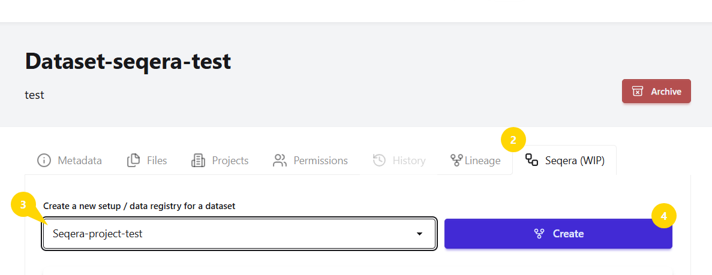

# Create a New Dataset

This guide walks you through the steps to create a new dataset in Data Catalog.

```{note}
Some fields are filled in automatically by the system after the dataset is created, such as **Dataset ID** and **Created by**. You can find them on the dataset's **Metadata** tab. They cannot be changed.
```

## Step 1: Navigate to the Dataset List Page 
Both of the following options will take you to the Dataset List page, where you can create a new dataset:

* Click the **`Datasets`** button on the Data Catalog welcome page 

    **or** 

* Use the **`Datasets`** tab located at the top of any page.


## Step 2: Add a New Dataset
On the Dataset List page, click the **`Add a new dataset`** button located right below the ***Search*** bar.


## Step 3: Choose a Parent Project
Select a project from the list to link your dataset. Only projects where you have the **Add Datasets** permission will appear in the list.


```{tip}
Choosing a Parent Project ***links*** your dataset to the project it belongs to. This ensures your data stays organized, easy to find and correctly associated. The parent project cannot be unlinked later, so make sure you pick the right one.
```


## Step 4: Fill in Dataset Metadata
Complete all the required fields marked with **`*`**:

* Dataset Name (`*`): must be unique, no other dataset can have the same name
* Dataset Description (`*`)
* Access rights (`*`): Restricted or BRIGHT-visible (default)
* Dataset Type (`*`):
    * Raw
    * Processed
    * Results

Depending on the data type, more fields appear:
* Resource Type (`*`): for Raw and Processed
* Instrument (`*`): for Raw (you can choose more than one)
* Data acquisition method: optional, only for Raw DNA or RNA sequencing
* Data acquisition facility (`*`): for Raw

```{note}
→ **Resource Type**: The type of experimental or analytical methodology that generates the data (e.g., DNA sequencing, RNA sequencing, Proteomics (DIA)).

→ **Instrument**: The equipment used to generate the data (e.g., MiSeq (Illumina), NextSeq (Illumina), GridION (Nanopore)).

→ **Data acquisition method**: The sequencing approach used (Long-read sequencing or Short-read sequencing).<br/>

→ **Data acquisition facility**: Where the data was generated (at BRIGHT or at an External facility).

```

## Final Step: Complete your Dataset
Click **`Create dataset`** at the ***bottom*** of the page to complete the process.


<br/>

-------------------------------

<br/>

```{raw} html
<div style="text-align: center;">
  <iframe 
    width="93%" 
    height="500" 
    src="https://youtube.com/embed/rF0PV_vUTKM"
    title="Dataset Creation"
    frameborder="0" 
    allow="accelerometer; autoplay; clipboard-write; encrypted-media; gyroscope; picture-in-picture" 
    allowfullscreen>
  </iframe>
  <p><em>Dataset Creation</em></p>
</div>
```
----------------------------

<br/>


```{tip}
→ Providing more context makes your dataset easier to **understand**, **discover**, and **reuse**, both for you and others.

→ If you are unsure about some details, you can always **include what you know** and **update the dataset info later** if needed.
```


-------------------------------------------


## Access Rights and Visibility 
Similar to projects, datasets have two access rights settings:

* **BRIGHT-visible:** 
    * Dataset metadata is visible (read-only) to all BRIGHT employees.

* **Restricted:** 
    * The dataset is completely hidden to all BRIGHT employees, except from users who have been explicitly granted permissions.

➣ By default, datasets as well as projects are set to **BRIGHT-visible**, but you can change the access rights when creating or editing a dataset.


Understanding how access rights affect visibility is important for collaboration:

```{note}

Users without assigned permissions (see {ref}`manage-dataset-user-permissions`) follow the dataset access rights:

→ For **BRIGHT-visible** dataset: Metadata is visible (read-only) to all BRIGHT employees

→ For **Restricted** datasets: Dataset is completely hidden

```
-------------------------------------------
(projects-tab)=
## Add Projects to Dataset

When you created the dataset, you already selected a "Parent project", which creates an initial relationship.
You can also **add** additional projects from the **Projects** tab on the dataset home page. 
This helps you associate the dataset with other research contexts.


```{note}
To add a project to a dataset, two conditions must be met:

→ You must have the **Add Datasets** permission on the project you want to add the dataset to
<br/>
→ You must have **access to the dataset** (either Bright-visible or through a dataset user permission, if it is restricted)

If either of these is missing, you will not be able to proceed.
```


### To add another project to a dataset:

1. Click the **`Projects`** tab on the dataset home page

2. Select the project you want to add from the list

3. Click **`Link`** to complete the process


To remove the relationship:

   * Click **`Unlink`**, and the project will be removed. The parent project cannot be unlinked.

<br/>


```{raw} html
<div style="text-align: center;">
  <iframe 
    width="93%" 
    height="500" 
    src="https://youtube.com/embed/KU8-4D6ltck"
    title="Add Project to Dataset and Dataset to Project"
    frameborder="0" 
    allow="accelerometer; autoplay; clipboard-write; encrypted-media; gyroscope; picture-in-picture" 
    allowfullscreen>
  </iframe>
  <p><em>Add Projects to Dataset</em></p>
</div>
```
-------------------------------------------

<br/>

```{note}
This relationship also appears under the **Datasets** tab on the **project** home page.
```

-------------------------------------------
(dataset-lineage)=
## Dataset Lineage

Once you have created a dataset you can define its **Lineage** by linkinng it to one or more datasets.

➣ Lineage creates a relationship that shows how datasets are related across different stages (e.g., raw → processed → results).

➣ It ensures **data provenance** by identifying source datasets when creating new ones (e.g., pipelines), supporting reproducibility.

```{important}
To create (or remove) a Dataset Lineage between datasets you must have the permission ***Link To*** on the **destination dataset**. Without this permission you will not be able to perform this action or see the destination dataset in the linking list.

The destination dataset is always the **descendant**.
```


### To add a Lineage:

1. Click the **`Lineage`** tab on the dataset home page

2. Choose the relationship type:
    * **`Add Ancestor`**, if the selected dataset creates the current dataset

      **or** 

    * **`Add Descendant`**, if the selected dataset is a result of the current dataset

3. Select the dataset from the list

4. Add a description explaining the relationship (optional)

5. Click the **`Link as Ancestor`** (or **`Link as Descendant`**) button to complete the process


To remove a Lineage:

   * Click **`Remove link from dataset`**
   * Select the link and click **`Delete`**
   
<br/>

-------------------------------

<br/>

```{raw} html
<div style="text-align: center;">
  <iframe 
    width="93%" 
    height="500" 
    src="https://youtube.com/embed/CHymgLBZsWg"
    title="Dataset Lineage"
    frameborder="0" 
    allow="accelerometer; autoplay; clipboard-write; encrypted-media; gyroscope; picture-in-picture" 
    allowfullscreen>
  </iframe>
  <p><em>Dataset Lineage</em></p>
</div>
```
----------------------------
(Seqera Workspace)=
### Analyze Datasets with Seqera (WIP- work in progress)

In the Seqera tab, you can set up a dataset as input for running Nextflow pipelines in Seqera. This works in two parts:

* Each **project** has one Seqera **workspace**
* Each **dataset** you want to analyze gets its own **data registry** inside the workspace

```{tip}
  → **Seqera workspace**: your project's space in Seqera, where pipelines run.

  → **Data registry**: a copy of a dataset's files inside the workspace, so your pipeline can read them.

  → **Nextflow**: the language the pipelines are written in. 
```

Once the analysis is complete, you can copy the results back to Data Catalog as a new dataset. Follow the steps below to get started:

#### Part 1: Set up the Project's Seqera workspace

You only need to do this once per project. If a project already has a workspace, skip to Part 2.

1. Open the project you want to set up the Seqera workspace for

2. Click the **`Seqera`** tab on the project home page

3. Click **`Set up Seqera workspace`**. A progress bar will appear while the workspace is being set up.

When the workspace is ready, you will see its name and the estimated cost of computation per hour. The data registries you create in Part 2 will also be listed here.

```{note}
You must have the **Setup Workspaces** permission on the project to set up a workspace.
```

#### Part 2: Create a Data Registry for a Dataset

1. Open the dataset with the files you want to use as input for running Nextflow pipelines

2. Click the **`Seqera`** tab on the dataset home page

3. From the dropdown list, select the project under which you want the result dataset to be created and to which the pipeline costs will be billed.

   > Only projects where you have the **Setup Workspaces** permission will appear in the list. The dataset's primary project is selected by default and shown first.

4. Click **`Create`** 

   > If the **`Create`** button is disabled, the project has no Seqera workspace yet (see Part 1).

5. After the data registry is created, click the **** next to the data registry name to view more details, and then click the **`View in Seqera Workspace`** button to open the workspace directly in Seqera.

6. In Seqera, select the pipeline you want to run and start your analysis as usual

7. Once the analysis is complete, return to Data Catalog and click the **`Copy into new dataset`** button. A dialog window will appear where you can:
    * Select or manually enter a **folder path**
    * Provide **metadata** for the new dataset. The name is pre-filled as "*data registry name* copy" and the Data type is set to **Results**, but you can change both.
    * Click **`Create dataset and copy`** to finalize the process
    * Click **`Open new dataset`** to go to the new dataset

  A new dataset containing the analysis results will be created and will be visible alongside other datasets under the "Datasets" tab on the project home page you selected in step 3.

```{note}
You must have the **Add Datasets** permission on the project to use **`Copy into new dataset`**.
```

```{note}
Please note that this functionality is still under development and may not work as expected at the moment.
```

```{raw} html
<div id="carousel" style="text-align:center; max-width:700px; margin:20px auto;">

  <p id="carousel-caption" style="color:#555; font-size:0.9em; margin-top:8px;">Steps: 1-4</p>
  <div style="margin-top:10px;">
    <button onclick="moveSlide(-1)" style="margin-right:10px; cursor:pointer;"><</button>
    <span id="carousel-counter" style="font-size:0.9em; color:#555;">1 / 5</span>
    <button onclick="moveSlide(1)" style="margin-left:10px; cursor:pointer;">></button>
  </div>
</div>

<script>
  const slides = [
    { src: "../../_static/images/seqera-steps-2-3-4.png", caption: "Steps: 1-4" },
    { src: "../../_static/images/seqera-step-5.png", caption: "Step 5"},
    { src: "../../_static/images/seqera-step-5a.png", caption: "Step 5"},
    { src: "../../_static/images/seqera-step-7.png", caption: "Step 7"},
    { src: "../../_static/images/seqera-new-dataset.png", caption: "Step 7"},
  ];
    let current = 0;
 function moveSlide(dir) {
    current = (current + dir + slides.length) % slides.length;
    document.getElementById('carousel-img').src = slides[current].src;
    document.getElementById('carousel-caption').textContent = slides[current].caption;
    document.getElementById('carousel-counter').textContent = (current + 1) + ' / ' + slides.length;
  }
</script>
```
(Manage Seqera Workspace)=
### Viewing and Managing Seqera Workspaces

The project's Seqera workspace and all its data registries are shown in:
* The **`Seqera`** tab on the project home page
* The **`Pipelines`** tab on the navigation bar (all workspaces you have access to)

For the **workspace** you can:
* **`Open`** it directly in Seqera, using the **** icon
* **`Delete`** it

From each **data registry** you can:
* **`Overwrite`:** updates the data registry in Seqera with the latest files from the dataset. Use this if you have added or changed files in the dataset after creating the
  data registry
* **`Copy into new dataset`:** creates a new dataset from the Seqera data registry
* **`Delete`:** removes the data registry entirely

The data registries of a dataset are also shown in the **`Seqera`** tab on the dataset home page.

<br/>


```{warning}
**Overwrite** and **Delete** cannot be undone.
```

```{note}
To set up a **workspace**, go to the **`Seqera`** tab on the **project home page** (see part 1). To create a **data registry**, go to **`Seqera`** tab on the **dataset home page** (see part 2).
```

<br/>

-------------------------------


## API Availability

The actions described in this page can also be performed programmatically. For more details, see the following endpoints in the API Reference:

* [**/datasets**](https://datacatalog.bright.dtu.dk/api/docs#/datasets/create_dataset_datasets_post) 
* [**/projects-datasets**](https://datacatalog.bright.dtu.dk/api/docs#/projects-datasets)
* [**/lineage**](https://datacatalog.bright.dtu.dk/api/docs#/lineage)