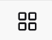

# Files

**Files** are the smallest data units in the system. Each file belongs to a dataset and represents a single piece of data, such as a sequence file, image, table, or model output in a specific format.


## Standard Upload

Once your dataset has been successfully created in Data Catalog, you can start adding files or directories directly from the dataset's home page. The upload options are located on the **Files** tab.

There are two ways to upload:

* **`Drag & Drop`** files or folders from your computer directly into the upload area

* Click **`New`** button to open a menu with the following options:
    * **`Create folder`** — create a new empty folder within the current directory
    * **`Upload files`** — select individual files from your local storage
    * **`Upload folder`** — upload an entire folder (ideal for keeping related files together)
    * **`Advanced upload`** — for large data uploads (see [Advanced Upload](advanced-upload))

➤ Once uploaded, files will appear in the list with details such as **name**, and **upload date**, making it easy to keep track of their content. You can switch between **grid view**  and **list view**  in the top-right corner of the files section.


```{note}
If a file with the same name already exists, a `File conflict` dialog appears — choose **`Cancel upload`** or **`Upload as copy`** to keep both files.
```


```{tip}
Files are queued on upload, meaning they transfer sequentially rather than in parallel. Total upload time depends entirely on your network's upload speed. For large transfers (5+ GB), use a **wired connection** instead of Wi-Fi to achieve faster and more stable uploads.
```

(advanced-upload)=
## Advanced upload
If you have a lot of large data to upload, we recommend that you use the **advanced upload** option. This creates an upload location, where you can upload your files using one of the following external tools:

* AzCopy
* Azure Storage Explorer

Let's see how to use each tool in more details:

### AzCopy
AzCopy is a command-line utility that allows you to transfer files and directories directly to the dataset's storage location.

Before you start, make sure you have AzCopy downloaded and saved on your computer. For more detailed installation instructions, see [**here**](https://learn.microsoft.com/en-us/azure/storage/common/storage-use-azcopy-v10).

```{note}
The commands below use Windows-style paths. If you are on Mac, replace backslashes `"\"` with forward slashes `"/"` and adjust the path accordingly (e.g. `"/Users/YOUR_USERNAME/"` instead of `"C:\Users\YOUR_USERNAME\"`).
```

1. Open Command Prompt (Windows) or Terminal (Mac)
2. Navigate to where AzCopy is saved on your computer
3. Log in to AzCopy: 

```bash
azcopy login
```

A link and a code will appear. Open the link in your browser, enter the code, and sign in with your Microsoft account.

4. Request a URL from Data Catalog
5. Upload files or folder using one of the following commands:

* **Specific files from the same folder:**

```{code-block}
azcopy copy "C:\Users\YOUR_USERNAME\Documents" "UPLOAD_URL" --include-pattern "file1.csv;file2.xlsx"
```

* **Entire folder:**

```{code-block}
azcopy copy "C:\Users\YOUR_USERNAME\Documents\my-data-folder" "UPLOAD_URL" --recursive
```

After the command finishes, AzCopy displays a summary. Make sure **Final Job Status: Completed** and the number of completed transfers matches your files.

6. Once the upload is complete, go back to Data Catalog and click **`Finalize Upload`**. This will transfer the files back to the dataset and make them visible in the file list.


<br/>

```{raw} html
<div style="text-align: center;">
  <iframe 
    width="93%" 
    height="500" 
    src="https://youtube.com/embed/x6FZLUmom_I"
    title="Advanced Upload using AzCopy"
    frameborder="0" 
    allow="accelerometer; autoplay; clipboard-write; encrypted-media; gyroscope; picture-in-picture" 
    allowfullscreen>
  </iframe>
  <p><em>Advanced Upload Using AzCopy</em></p>
</div>
```
----------------------------


### Azure Storage Explorer
Azure Storage Explorer is a free desktop application by Microsoft. It is an alternative to AzCopy for users who prefer not to use the command line.
For more information on how to install see [**here**](https://learn.microsoft.com/en-us/azure/storage/storage-explorer/vs-azure-tools-storage-manage-with-storage-explorer?tabs=windows).

1. Request a URL from Data Catalog
2. Open Azure Storage Explorer and log in with your Microsoft account
3. Click **`plug icon`** on the left side bar to open the Connect dialog
4. Select **`ADLS Gen2 container or directory`**
5. Select **`Sign in using OAuth`** and click `next`
6. Select your Azure account and click `next`
7. Optionally give the connection a display name and paste the upload URL provided from the  Data Catalog, then click `next`
8. Click **`Connect`**
9. Upload your files or folders to the upload location. Check the **Activities** panel at the bottom to make sure all transfers completed successfully.
10. Go back to Data Catalog and click **`Finalize Upload`** to move the files into the dataset and make them visible in the files list.

<br/>

```{raw} html
<div style="text-align: center;">
  <iframe 
    width="93%" 
    height="500" 
    src="https://youtube.com/embed/bSUHLbymZEw"
    title="Advanced Upload using Azure Storage Explorer"
    frameborder="0" 
    allow="accelerometer; autoplay; clipboard-write; encrypted-media; gyroscope; picture-in-picture" 
    allowfullscreen>
  </iframe>
  <p><em>Advanced Upload Using Azure Storage Explorer</em></p>
</div>
```


----------------------------------

## Manage Files

You can perform basic actions on files or directories in Data Catalog. Select one or more items to use **Download**, **Move**, or **Delete** from the toolbar, or click the ( **⁝** ) icon on an individual file or folder for more options:

* **`Preview`**: view the file without downloading it
* **`Download`**
* **`Rename`**
* **`Cut`**: select the item, then right-click the destination folder and select **`Paste`**
* **`Copy`**: *under development*
* **`Move`**: move a file or folder to a different destination folder. You can move individual files between folders, or move an entire folder (along with its contents) into another folder.
* **`Delete`**

**Please review files before deleting to avoid accidental data loss.*

```{note}

If you move a file into a destination that already has a file with the same name, you'll be prompted to either **`Cancel`** or **`Rename and move`**, which lets you enter a new name for the incoming file before it's moved.

```


<br/>

-------------------------------

<br/>

```{raw} html
<div style="text-align: center;">
  <video width="93%" controls autoplay loop muted playsinline>
    <source src="../../_static/images/manage_files_updated.mp4" type="video/mp4">
  </video>
  <p><em>Manage files</em></p>
</div>
```
----------------------------

<br/>


```{warning}
Currently, deleting a file permanently removes it from Data Catalog. However, files can still be **restored within 7 days** of deletion through the storage account. If you need to restore a file, please contact us [here](mailto:dinghe@dtu.dk?cc=pasdom@dtu.dk&subject=Data%20Catalog%20-%20File%20Restore%20Request&body=Project%2FDataset%20name%3A%0D%0A%0D%0AFile%20name%3A%0D%0A%0D%0ADate%20deleted%3A%0D).

**Keep in mind that this behavior may change in future releases.*
```


<br/>

-------------------------------


## API Availability

Some of the actions described in this page can also be performed programmatically. For more details, see the following endpoints in the API Reference:

* [**/files**](https://datacatalog.bright.dtu.dk/api/docs#/files) 
