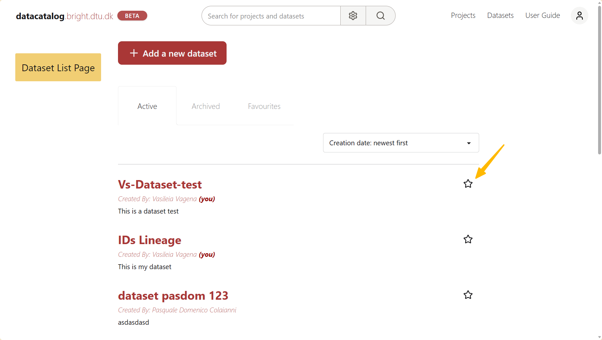

# Search & Favourites

Data Catalog makes it easy to find projects and datasets quickly using keywords, filters and favourites. This guide explains the available search options and how to use favourites.

## ➤  Basic Search
At the top of the page, you will find the **`Search bar`**. Simply type any relevant keyword such as the project or dataset name, and Data Catalog will display matching results.

→ The **search** looks for your keyword in the **name** and **description** of projects and datasets. Partial words also work, but typos are not 
corrected, so check the spelling if you don't find what you are looking for.

## ➤  Advanced Search

For more precise results, you can use the Advanced search. It helps you narrow down your results by applying filters, making it easier to find what you are looking for. To open it, click the **gear** button next to the search bar, set your filters and click **`Apply & Search`**.

Available filters include:

* **Archive Status:** Choose from ***Active only*** (default), ***Archived*** or ***All***
* **Entity Type:** Select whether you want ***Projects & Datasets***, ***Projects only*** or ***Datasets only***
* **Project or Dataset filters:** Appear when you choose ***Projects only*** or ***Datasets only*** in Entity Type:
    * Projects: Principal Investigator (PI), LIMS (Benchling) project
    * Datasets: Data type, Resource type, Instrument, Data acquisition method, Data acquisition facility
* **Entity Name:** You can type the full name or just part of it
* **Created by:** Filter by the full name of the person who created the project or dataset
* **Description:** Search only in the description
* **Access rights:** Choose from ***All***, ***Restricted*** or ***BRIGHT-visible***

```{tip} 
To make your search more precise, try combining **multiple filters** at once.
```


<br/>

-------------------------------

<br/>

```{raw} html
<div style="text-align: center;">
  <iframe 
    width="93%" 
    height="500" 
    src="https://youtube.com/embed/AbcN9G92dWs"
    title="Search"
    frameborder="0" 
    allow="accelerometer; autoplay; clipboard-write; encrypted-media; gyroscope; picture-in-picture" 
    allowfullscreen>
  </iframe>
  <p><em>Search</em></p>
</div>
```
----------------------------

## Favourites

The Favourite feature allows you to mark frequently used projects and datasets for quick access. Favourite items appear under the **Favourites** tab, next to the Active and Archived tabs, on the Projects and Datasets list pages.

### Adding and removing favourites

1. Navigate to the **Projects** or **Datasets** list page
2. Click the **** icon next to its name to mark it as a favourite
3. To remove a favourite, click the star icon again

The screenshots below show how to mark a dataset as favourite. The same applies to projects.

```{raw} html
<div id="carousel" style="text-align:center; max-width:700px; margin:20px auto;">
  
  <p id="carousel-caption" style="color:#555; font-size:0.9em; margin-top:8px;">The star icon on the dataset list page</p>
  <div style="margin-top:10px;">
    <button onclick="moveSlide(-1)" style="margin-right:10px; cursor:pointer;"><</button>
    <span id="carousel-counter" style="font-size:0.9em; color:#555;">1 / 2</span>
    <button onclick="moveSlide(1)" style="margin-left:10px; cursor:pointer;">></button>
  </div>
</div>

<script>
  const slides = [
    { src: "../_static/images/favorite-icon-ds.png", caption: "The star icon on the dataset list page"},
    { src: "../_static/images/favorites-tab.png", caption: "The Favorites section for datasets"},
  ];
    let current = 0;
 function moveSlide(dir) {
    current = (current + dir + slides.length) % slides.length;
    document.getElementById('carousel-img').src = slides[current].src;
    document.getElementById('carousel-caption').textContent = slides[current].caption;
    document.getElementById('carousel-counter').textContent = (current + 1) + ' / ' + slides.length;
  }
</script>
```


--------------------------------

## API Availability

The search can also be performed programmatically. For more details, see the following endpoint in the API Reference:

* [**/search**](https://datacatalog.bright.dtu.dk/api/docs#/search/search_search_post)
