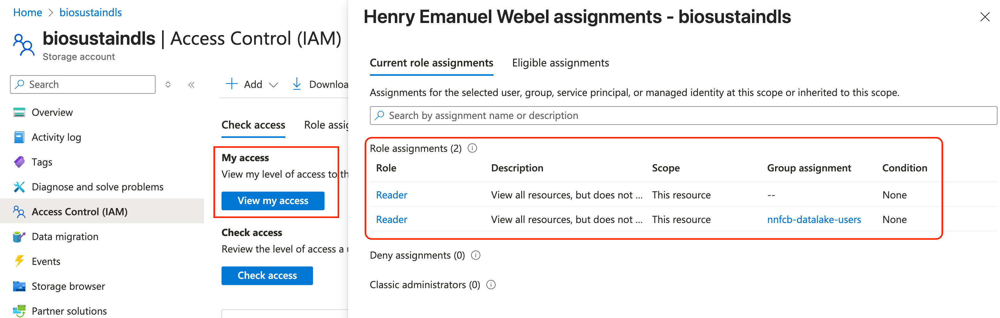
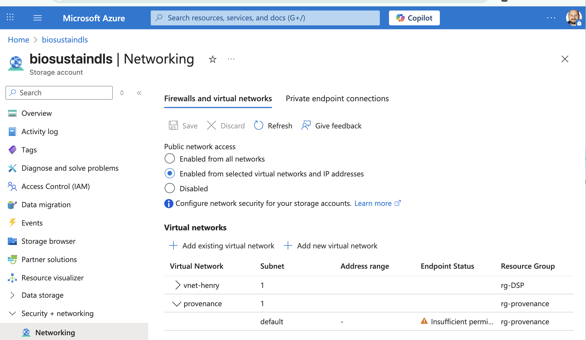

# Copy data from the Data Lake

Scenario: A user wants to use her data on a virtual machine (VM) and needs to copy it
from the Data Lake storage account (`biosustaindls`) to the VM.

## Pre-requisites

### Roles in biosustaindls storage account

Each user is assigned a role `Reader` through the group called `nnfcb-datalake-users` 
to allow them to see the `biosustaindls` storage account in the Azure portal. 
However, on the container level the ACL entries restrict access to the project folders
the user is a contributor or owner of - effectively giving `read` permissions.

> [!NOTE]  
> User cannot see their project folders in the containers with this role.



### Networking access

Add `vnet` associated to your virtual machine to the `biosustaindls` storage account
`Networking` settings. This allows the VM to reach the storage account.



Which `vnet` your VM uses can be seen on the Overview page of the VM in the Azure portal, where you also see the VMs operating system, which is needed in the next
step to install `azcopy`:


## Install `azcopy`

`biosustaindls` is the storage account for the Data Lake. Instruction to install `azcopy` 
can be found in the
[official documentation](https://learn.microsoft.com/en-us/azure/storage/common/storage-use-azcopy-v10?tabs=apt).

To find out your Linux distribution, you can run the following command:

```bash
# Get the release of your Linux distribution
lsb_release -a
```

An example ouput is the following where you would use `ubuntu` and `24.04` as of the 
current instructions (up for change):

```bash
No LSB modules are available.
Distributor ID: Ubuntu
Description:    Ubuntu 24.04.1 LTS
Release:        24.04
Codename:       noble
```
## login to azcopy

```
azcopy login
```

## copy data

Copy a project folder on the Data Lake (`biosustaindls`) to a local folder called `data`.
Here the `<container>` is `raw` and the `<project-id>` is `P29_327448795...f` (abbreviated),
which is the folder name in the main directory of that container. All data from that project
would be copied to the `data` folder.

```bash
azcopy copy 'https://biosustaindls.dfs.core.windows.net/<container>/<project-id>' 'data' --recursive
azcopy copy 'https://biosustaindls.blob.core.windows.net/<container>/<project-id>' 'data' --recursive
```
